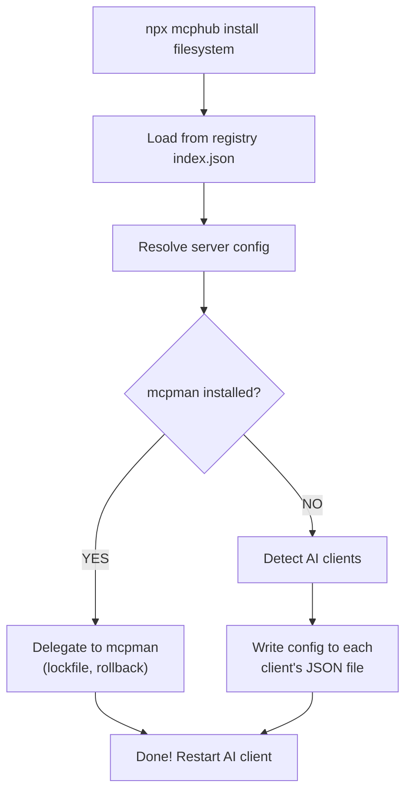
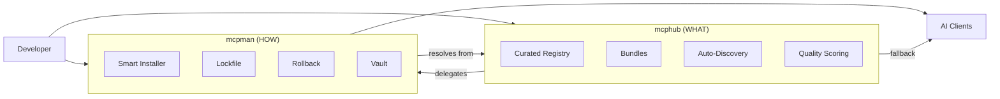

# mcphub

Centralized hub for curated MCP (Model Context Protocol) servers. Browse, search, and install MCP servers across multiple AI clients from a single CLI.

## Why mcphub?

Setting up MCP servers means finding the right packages, figuring out config formats for each AI client, and managing environment variables. mcphub solves this:

- **40+ curated servers** — Verified configs ready to install in one command
- **5 bundles** — Pre-built collections by use case (web-dev, data-science, devops, full-stack, productivity)
- **5 AI clients** — Claude Desktop, VS Code, Cursor, Windsurf, Claude Code
- **Auto-discovery** — Finds 400+ servers from npm automatically
- **Zero config** — Works instantly with `npx`, no global install needed

## Quick Start

```bash
# Install a single server
npx mcphub install filesystem

# Install a bundle (multiple servers at once)
npx mcphub bundle install web-developer

# Search servers
npx mcphub search database

# List all available servers
npx mcphub list

# Show server details
npx mcphub info postgres

# Show bundle contents before installing
npx mcphub bundle show devops
```

## Available Bundles

| Bundle | Servers | Use Case |
|--------|---------|----------|
| **web-developer** | filesystem, git, github, fetch, puppeteer, postgres, sequential-thinking | Frontend & backend web dev |
| **data-science** | filesystem, postgres, sqlite, fetch, memory, sequential-thinking | Data analysis & AI workflows |
| **devops** | docker, kubectl, aws, github, git, sentry | Infrastructure & deployment |
| **full-stack** | filesystem, git, github, fetch, puppeteer, postgres, docker, sequential-thinking, memory | Complete dev setup |
| **productivity** | slack, notion, linear, jira, github | Communication & project management |

## How It Works

> [View interactive architecture diagram on Excalidraw](https://excalidraw.com/#json=yPIOD2dxsstmfz2cvqpXk,zP-lcGRPTD5Hba3CtK1Jkw)



mcphub reads server configs from its curated registry and writes them to the correct config file for each detected AI client:

| Client | Config Path | Root Key |
|--------|------------|----------|
| Claude Desktop | `%APPDATA%/Claude/claude_desktop_config.json` | `mcpServers` |
| Cursor | `%APPDATA%/Cursor/User/globalStorage/cursor.mcp/mcp.json` | `mcpServers` |
| VS Code | `~/.vscode/mcp.json` | `servers` |
| Windsurf | `~/.windsurf/mcp.json` | `mcpServers` |
| Claude Code | `~/.claude/settings.json` | `mcpServers` |

## With mcpman

[mcpman](https://github.com/user/mcpman) is a full-featured MCP package manager. mcphub integrates with it seamlessly:



**mcphub = what to install** (curated catalog, bundles, scoring)
**mcpman = how to install** (lockfile, rollback, version management, 10+ clients)

### Option 1: Automatic (Recommended)

If mcpman is installed globally, mcphub automatically delegates to it:

```bash
npm install -g mcpman
npx mcphub install filesystem    # → automatically uses mcpman under the hood
```

### Option 2: mcpman Registry

Add mcphub as a registry source in mcpman:

```bash
mcpman registry add mcphub https://raw.githubusercontent.com/user/mcphub/main/registry/index.json
mcpman install mcphub:filesystem
mcpman install mcphub:postgres
```

### Option 3: mcpman Plugin

For richer integration (search, bundles via mcpman):

```bash
# Copy plugin to ~/.mcpman/plugins/mcphub/
mcpman install mcphub:filesystem    # Resolves from mcphub registry
```

### Standalone (No mcpman)

mcphub works perfectly without mcpman. It writes configs directly to your AI client files. mcpman just adds lifecycle features (lockfile, rollback, updates).

## Server Categories

| Category | Examples |
|----------|---------|
| **developer-tools** | filesystem, git, github, gitlab, eslint, storybook, context7, openapi |
| **database** | postgres, sqlite, supabase |
| **web** | fetch, brave-search, puppeteer, chrome-devtools, tavily, apify |
| **ai** | memory, sequential-thinking |
| **cloud** | aws, azure |
| **devops** | docker, kubectl, circleci |
| **productivity** | notion, linear, jira, clickup, salesforce, hubspot, google-calendar |
| **analytics** | sentry, datadog, dynatrace |
| **design** | figma, drawio |
| **communication** | slack |

## Contributing

Want to add an MCP server? See [CONTRIBUTING.md](./CONTRIBUTING.md).

**TL;DR:** Create a YAML file, submit a PR, CI validates automatically.

## Project Structure

```
mcphub/
├── registry/
│   ├── servers/        # 40 curated server YAML configs
│   ├── bundles/        # 5 curated bundles
│   └── discovered/     # 400+ auto-discovered servers
├── cli/                # Standalone CLI (npx mcphub)
├── website/            # GitHub Pages static site
├── schema/             # JSON Schema for validation
├── scripts/            # Validate, build, discover, health-check
└── .github/workflows/  # CI: validate PRs, build, release, discover, health
```

## License

[MIT](./LICENSE)
